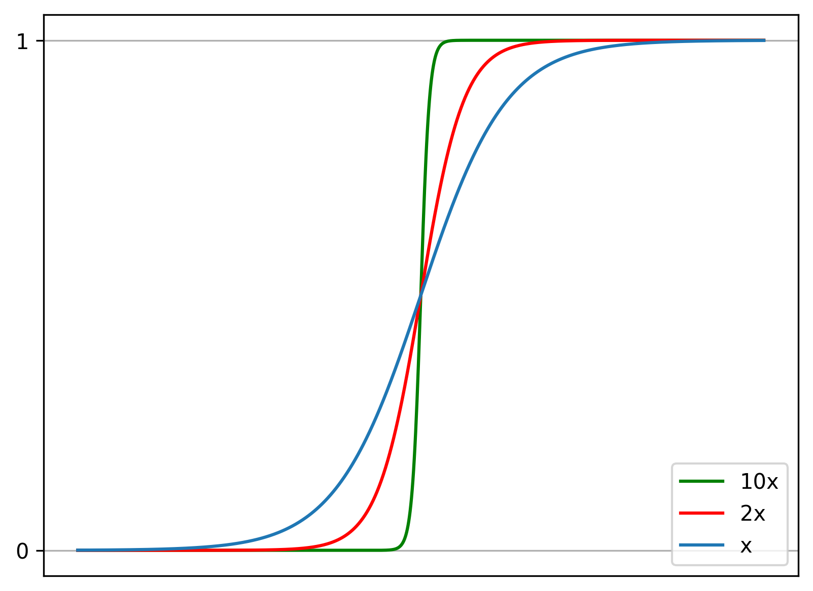

The solution to a classification problem is a prediction of some
independent variables' class from a finite number of labels, rather than
a real-valued output as in linear regression. In the case of binary
classification, a classification problem with two classes, _logistic
regression_ can be used to fit a statistical model's parameters to an
observed distribution.

# Initialisation

A handful of modules and convenience functions are required for the
subsequent examples.

```python
import matplotlib as mpl
import matplotlib.pyplot as plt
from matplotlib.ticker import (MultipleLocator, AutoMinorLocator, FormatStrFormatter)
import numpy as np
import sklearn.datasets
import math
%matplotlib inline

def new_plot():
    fig = plt.figure(dpi=300)
    ax = fig.add_subplot(1,1,1)
    ax.set_xticks([])
    ax.set_yticks([])
    ax.set_aspect('auto')
    return fig, ax
```

# Logistic Function

The _sigmoid_ or _logistic_ function returns a value in the interval
$(0,1)$ and is defined:

<!-- In logistic regression, the vector product of the weights and -->
<!-- inputs is passed through this logistic function. This function is -->
<!-- differentiable at all points and it is continuous in its input. The -->
<!-- logistic function is a _soft_ threshold function. -->

$$\sigma(u) = \dfrac{1}{1+e^{-u}}$$

The inverse of the logistic function is the _logit_ or _log-odds_
function for some observation according to a probability distribution:

$$\sigma^{-1}(u) = \log\left(\dfrac{p}{1-p}\right)$$

<!-- In logistic regression, this value represents the probability that the -->
<!-- dependent variable takes some value, given a vector of paramaters and -->
<!-- an observation. -->
<!---->
<!-- $$ P(Y=y|\mathbf{w},\mathbf{x}) = \sigma(\mathbf{w}^T\mathbf{x})$$ -->

The sigmoid function, in code:

```python
def sigmoid(u):
    return 1 / (1+math.e ** -u)
```

The sigmoid function, visualised:

```python
x = np.linspace(-8, 8, 1000)
f, ax = new_plot()
ax.set_xticks([])
ax.yaxis.set_major_locator(MultipleLocator(1))
ax.grid()
ax.plot(x, sigmoid(10 * x), 'green', label="10x")
ax.plot(x, sigmoid(2 * x), 'red', label="2x")
ax.plot(x, sigmoid(x), label="x")
ax.legend(loc='lower right')
```

{#fig:sigmoid
.nocaption}

# Principles of Logistic Regression

Logistic regression models the _log-odds_ of a binary outcome in a
Bernoulli distribution as a linear combination of the independent
variable. Consequently, the probability that the random variable $Y$
takes the value $1$ is the application of the logistic function to this
linear combination.

$$p = P(Y = 1)$$

$$\log\left(\dfrac{p}{1-p}\right) = w_0x_0 + w_1x_1 + \ldots + w_nx_n$$

$$\mathbf{w} = \langle w_0, w_1 \ldots w_n \rangle$$

$$\mathbf{x} = \langle x_0 = 1, x_1 \ldots x_n \rangle$$

$$P(Y=1|\mathbf{w},\mathbf{x}) = \sigma(\mathbf{w}^T\mathbf{x})$$

$$P(Y=1|\mathbf{w},\mathbf{x}) = h_{\mathbf{w}}(\mathbf{x})$$

In this binary classification problem, the model
$h_{\mathbf{w}}(\mathbf{x})$ is the linear function
$\mathbf{w}\cdot\mathbf{x}$ passed through a _threshold function_,
returning a probability that can be converted to the dependent
variables' classification via a random variable, rather than a real
value as in regression. This linear function is called the _decision
boundary_ or _linear separator_. A data set admitting a linear separator
is considered _linearly separable_ and there exists a solution to the
function $h$ with zero cost. If the data set is linearly separable, the
[percepton learning rule](./linear-regression.md#multivariable-linear-regression)
for each element $w_i$, $x_i$ of $\mathbf{w}$, $\mathbf{x}$ will
converge on an exact solution.

$$w_i \leftarrow w_i - \alpha (h_{\mathbf{w}}(\mathbf{x}) - y) \times x_{i}$$

# Maximum Likelihood Estimation

Given a model with parameters $\mathbf{w}$, a cost function must be
provided to quantify the error of the current model. _Likelihood_ is a
function of the parameters of a model (in this case, $\mathbf{w}$)
measuring the probability of the observed data occurring under that
model.

$$\mathcal{L}(\mathbf{w} | y; \mathbf{x}) = P(Y = y | \mathbf{w},\mathbf{x})$$

As the logistic regression problem is known to follow a Bernoulli
distribution, the probability mass function for each outcome $y$ of the
random variable $Y$ is:

$$
P(Y = y | \mathbf{w},\mathbf{x}) =
\begin{cases}
h_{\mathbf{w}}(\mathbf{x}) & \text{if } y = 1 \\
1-h_{\mathbf{w}}(\mathbf{x}) & \text{if } y = 0
\end{cases}
$$

This can be expressed in a single expression as:

$$P(Y = y | \mathbf{w},\mathbf{x}) = h_{\mathbf{w}}(\mathbf{x})^y (1-h_{\mathbf{w}}(\mathbf{x}))^{1-y}$$

Maximising this value, the likelihood, will fit the model to the
observations, through it is more common to minimise the negative
log-likelihood, given by:

$$
L(\mathbf{w}) = -(y\log(h_{\mathbf{w}}(\mathbf{x})) +
(1-y)\log(1-h_{\mathbf{w}}(\mathbf{x})))
$$

The average cost over many examples:

$$L(\mathbf{w}) = -\frac{1}{N}\sum_n^N (y_{n}\log(h_{\mathbf{w}}(\mathbf{x}_n)) + (1-y_n)\log(1-h_{\mathbf{w}}(\mathbf{x}_n)))$$

The derivative of the cross-entropy cost function:

$$\nabla L(\mathbf{w}) = -\frac{1}{N}\sum_n^N (y_{n} - h_{\mathbf{w}}(\mathbf{x}_n))\times \mathbf{x}_n$$

The weight update rule for each $w$ in $\mathbf{w}$:

$$w_i \leftarrow w_i + \alpha\sum_n^N (y_{n} - h_{\mathbf{w}}(\mathbf{x}_n))\times x_{n,i}$$

With theses expressions, it is possible to perform _logistic
regression_, and update the weights of the underlying function to redraw
the decision boundary.

```python
def create_minibatches(a, m):
    n = int(x.shape[0] / m)
    return np.array_split(a[:m * n], n), n

def h(W, X):
    return sigmoid(sum(W * X))


def logistic_regression(a, m, W, y, X):
    X = np.concatenate((np.ones((X.shape[0],1), dtype=int), X), axis=1)
    X, n = create_minibatches(X, m)
    y, n = create_minibatches(y, m)
    for b in range(n):
        for w in range(W.size):
            W[w] += a * sum([((h(W, X[b][x])) - y[b][x]) * X[b][x][w] for x in range(X[b].shape[0])])
    return W
```

In this example, the points are labelled in advanced (logistic
regression is always a supervised problem). The decision boundary is
drawn between the two classes. Note that this example is not linearly
separable as the cost on the training set is not $0$; it is a fairly good
predictor, however.

```python
X, y = sklearn.datasets.make_classification(n_samples=200,
                                            n_features=2,
                                            n_redundant=0,
                                            n_informative=1,
                                            n_clusters_per_class=1)
W = np.array([0.,0.,0.])
for _ in range(10):
    W = logistic_regression(0.001, 10, W, y, X)

f, ax = new_plot()
colors = ["blue", "red"]
ax.scatter(X[:, 0], X[:, 1],
           marker=".", c=y, s=1,
           cmap=mpl.colors.ListedColormap(colors))
ax.plot(X[:, 0],
        [X[i, 0] * (W[1] / (-1 * W[2]))
                  + W[0] for i in range(X.shape[0])],
        'green')
```

{#fig:linearclassification
.nocaption}
